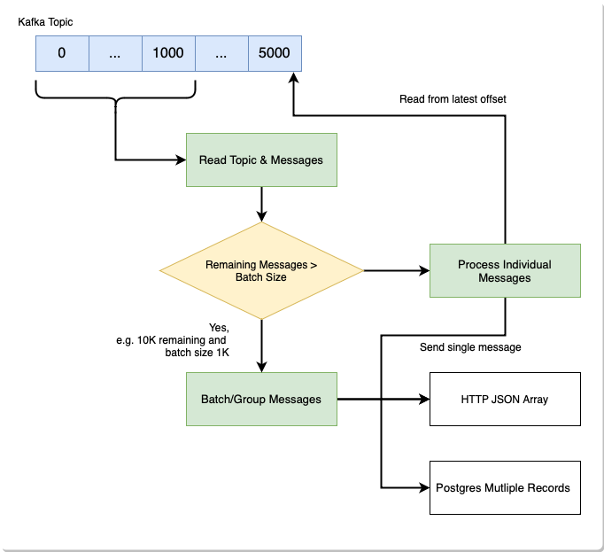

# Kafka Sink

## Overview

This projects aims to provide an alternative way to transport messages out of Kafka. The primary driver for this is to support sending messages in a "batch" rather than one-by-one.

In a lot of contexts, adding or accepting messages incurs an overhead meaning it's more efficient to send messages in batches. For example over HTTP there are SSL handshakes, Packet overhead, and ensuring any HTTP proxy can handle certain throughput.

Meanwhile the majority of tools used in conjunction with large data volumes support processing data in batches or groups.

## Functionality

Currently this runs as a standalone application, reading config from a `dotenv` file, but this will be replaced by [clap | GitHub].

Only HTTP is supported as a destination, but this will expand to at least Postgres, and potentially [Meilisearch | GitHub].

### Wishlist

- [ ] CLI & Clap
- [ ] Postgres Sink
- [ ] Pre-flight checks (Postgres table exists, HTTP endpoint is reachable)
- [ ] Rate limiting
- [ ] Retry logic with exponential backoff
- [ ] Meilisearch Sink

## Development

Using [Materialize - Datagen | Github], we generate test data in a docker compose setup. By default 500 records are sent to a `users` topic when you run `docker-compose up`.

To check the topics with a UI, open Redpanda Console: `open localhost:8080`

[materialize - datagen | github]: https://github.com/MaterializeInc/datagen
[clap | github]: https://github.com/clap-rs/clap
[meilisearch | github]: https://github.com/meilisearch/MeiliSearch
    